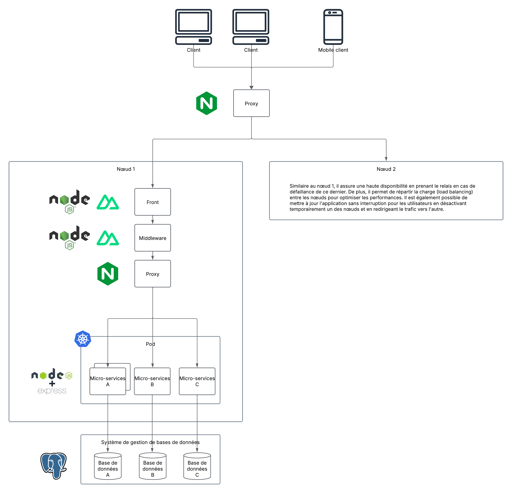

# Pep'eat
##### Projet bloc web avancé - 2025
##### Groupe 2 : [DEXES Victor](https://github.com/VictorDexes) - [MENANTEAU Melvin](https://github.com/Melvin-Menanteau) - [MERCIER Charly](https://github.com/Charlyhno-eng) - [PETIT Victor](https://github.com/Faugnell)

## Sommaire

- 1. [Présentation de l'équipe et des rôles](#1-présentation-de-léquipe-et-des-rôles)
- 2. [Reformulation du besoin](#2-reformulation-du-besoin)
- 3. [Reformulation des points critiques et analyse des risques](#3-reformulation-des-points-critiques-et-analyse-des-risques)
  - 3.1 [Reformulation des points critiques](#31-reformulation-des-points-critiques)
  - 3.2 [Analyse des risques (AMDEC)](#32-analyse-des-risques-amdec)
- 4. [Présentation de l'architecture](#4-présentation-de-larchitecture)
  - 4.1 [Architecture logicielle](#41-architecture-logicielle)
  - 4.2 [Architecture réseau](#42-architecture-réseau)
- 5. [Choix des technologies](#5-choix-des-technologies)
  - 5.1 [Moins de re-rendus inutiles](#51-vue-vs-react---moins-de-re-rendus-inutiles)
  - 5.2 [Syntaxe plus simple et intuitive](#52-vue-vs-react---syntaxe-plus-simple-et-intuitive)
  - 5.3 [Documentation plus accessible](#53-vue-vs-react---documentation-plus-accessible)
- 6. [Maquette de l'application](#6-maquette-de-lapplication)
- 7. [Diagramme de cas d'utilisation](#7-diagramme-de-cas-dutilisation)
- 8. [Diagramme de la base de données](#8-diagramme-de-la-base-de-données)
- 9. [Présentation du plan d’intégration et de déploiement continu](#9-présentation-du-plan-dintégration-et-de-déploiement-continu)
- 10. [Planification prévisionnelle](#10-planification-prévisionnelle)
  - 10.1 [Découpage du projet en phases](#101-découpage-du-projet-en-phases)
  - 10.2 [Notre organisation](#102-notre-organisation)
  - 10.3 [Répartition des tâches et estimations de charge de travail](#103-répartition-des-tâches-et-estimations-de-charge-de-travail)
- 11. [Questions à débattre](#11-questions-à-débattre)
  - 11.1 [Ajustement de base de données](#111-ajustement-de-base-de-données)
  - 11.2 [Utilisation de Kafka](#112-utilisation-de-kafka)
  - 11.3 [Alternative de technologies](#113-alternative-de-technologies)

## 1. Présentation de l'équipe et des rôles

- **Dexes Victor :** UX/UI + Développeur fullstack
- **Menanteau Melvin :** Lead dev + Développeur fullstack
- **Mercier Charly :** Chef de projet - Développeur fullstack
- **Petit Victor :** DevOps + Développeur fullstack

## 2. Reformulation du besoin

Pep’eat est une plateforme web de gestion de commandes et de livraisons de repas. L’application vise à offrir une expérience fluide et intuitive aux restaurateurs, livreurs et clients en garantissant une performance optimale et une accessibilité sur tous les types d’appareils.

L’application repose sur une architecture en microservices permettant une modularité et une scalabilité optimales. Chaque service est dédié à un domaine spécifique, comme la gestion des restaurants, des commandes, des livraisons, des paiements et des notifications.

## 3. Reformulation des points critiques et analyse des risques

### 3.1. Reformulation des points critiques  

L’un des principaux défis du projet repose sur la disponibilité et la fiabilité des services. Une indisponibilité de la plateforme middleware pourrait empêcher l’accès aux services pour tous les utilisateurs, entraînant une perte de commandes et une insatisfaction générale. De même, une défaillance d’un microservice pourrait impacter plusieurs fonctionnalités essentielles. Il est donc crucial de mettre en place des mécanismes de monitoring et une architecture résiliente, capable d’anticiper et de gérer ces pannes efficacement. De plus, des erreurs dans l’intégration des API ou une documentation incomplète compliqueraient l’intégration de solutions tierces, d’où la nécessité de tester en continu les interfaces et de maintenir une documentation détaillée et à jour.

Un autre point critique concerne la gestion des données et la sécurité. Une perte de données lors des écritures pourrait corrompre des informations critiques comme les commandes ou les données clients, compromettant ainsi le bon fonctionnement de la plateforme. Il est impératif de mettre en place des sauvegardes régulières et une gestion rigoureuse des erreurs. En parallèle, des failles de sécurité dans l’authentification pourraient exposer des informations sensibles à des accès non autorisés. L’implémentation de protocoles de sécurité robustes (authentification forte, chiffrement des données) est indispensable. Enfin, pour assurer une expérience utilisateur optimale, il faudra veiller à la fluidité de l’interface, au bon fonctionnement des notifications et au suivi précis des livraisons afin de garantir un service fiable et efficace.

### 3.2. Analyse des risques (AMDEC)

||**Composant**|**Mode de défaillance**|**Effet de la défaillance**|**Fréquence (F)**|**Gravité (G)**|**Détectabilité (D)**|**Criticité (C = F * G * D)**|**Actions recommandées**|
|--|--------------|-------------|-------------------------------------------|-------------------|-----------------|-----------------------|-------------------------|----------------------------------------|
|1|Plateforme Middleware|Indisponibilité des services ou des composants|Inaccessibilité de la plateforme pour les utilisateurs|3|4|3|36|Mettre en place des mécanismes de monitoring des services|
|2|API|Erreur dans l'intégration de composants|Application tierce non fonctionnelle ou incompatible|2|3|3|18|Tester en continu les API et documenter les versions pour garantir la compatibilité|
|3|Base de données Relationnelle|Perte de données lors de l'écriture|Corruption de données critiques (commandes, informations clients)|2|4|2|16|Implémenter des sauvegardes régulières et une gestion des erreurs lors des écritures|
|4|Microservices|Défaillance d'un microservice|Service spécifique indisponible, impact sur plusieurs fonctionnalités|3|4|2|24|Mettre en place une architecture résiliente avec une gestion des pannes des microservices|
|5|Application Client|Problèmes d'interface utilisateur (UI/UX)|Mauvaise expérience utilisateur, baisse de satisfaction|2|3|3|18|Réaliser des tests utilisateurs et optimiser l'UI pour la rendre plus intuitive|
|6|Sécurité (Authentification) |Failles de sécurité dans l'authentification|Accès non autorisé aux données des utilisateurs ou restaurateurs|2|4|2|16|Renforcer les politiques de sécurité (authentification forte, chiffrement des données)|
|7|Livraison|Problèmes dans la gestion des livraisons|Retards, erreurs de livraison, mauvaise expérience client|3|3|3|27|Développer une fonctionnalité de suivi en temps réel et des alertes sur les livraisons|
|8|Notifications|Notifications non envoyées ou mal configurées|Informations importantes non reçues par les utilisateurs|3|3|3|27|Améliorer le système de notification et effectuer des tests de réception|
|9|Service Commercial|Erreur dans la gestion des commandes ou suivi des paiements |Perte de commandes, erreurs dans la facturation des clients|2|4|2|16|Auditer régulièrement le système de gestion des commandes et des paiements|
|10|Développeur tiers|Mauvaise documentation des API|Difficulté pour les développeurs tiers à intégrer des composants|3|3|3|27|Améliorer et maintenir une documentation API complète et bien structurée|

## 4. Présentation de l'architecture

### 4.1. Architecture logicielle

Le développement de cette application web s'articulera autour d'une architecture en micro-services. Cette approche permet de découper l'application en plusieurs services indépendants, chacun ayant sa propre base de données et son propre serveur. Chaque micro-service sera responsable d'une fonctionnalité spécifique de l'application, ce qui facilite la maintenance, le déploiement et l'évolutivité du système. Les micro-services communiqueront entre eux via des API RESTful, garantissant une architecture décentralisée et scalable.

Les différents micro-services que nous avons identifiés pour l'application Pep'eat sont les suivants :

**Articles et des menus** :
- Création d'un article
- Modification d'un article
- Suppression d'un article
- Consultation des articles
- Création d'un menu (ensemble d'articles)
- Modification d'un menu
- Suppression d'un menu
- Consultation des menus
- Ajout d'un article à un menu
- Suppression d'un article d'un menu
- Consultation des articles d'un menu
- Consultation des menus d'un restaurant
- Consultation des articles d'un restaurant

**Authentification** :
- Inscription et connexion des utilisateurs

**Commandes** :
- Création d'une commande
- Passation d'une commande
- Acceptation d'une commande
- Refus d'une commande
- Historique des commandes

**Composants développeurs tiers** :
- Création d'un composant
- Modification d'un composant
- Suppression d'un composant
- Consultation des composants
- Téléchargement d'un composant

**Comptes** :
- Création d'un compte
- Modification des informations personnelles
- Suppression du compte
- Consultation du compte
- Suspension du compte
- Clé API associée au compte
- Parainage d'un ami

**Livraisons** :
- Suivi des livraisons (état de la commande, localisation du livreur)
- Historique des livraisons
- Accepter une livraison
- Refuser une livraison
- Acquitter une livraison

**Logs** :
- Enregistrement des logs de l'application (connexion des utilisateurs, commandes effectuées, téléchargement de composants, erreurs, ...)
- Consultation des logs

**Notifications** :
- Envoi de notifications aux utilisateurs (commandes, livraisons, promotions)

**Paiements** :
- Paiement en ligne
- Historique des paiements

**Restaurants** :
- Création d'un restaurant
- Modification des informations du restaurant
- Suppression du restaurant
- Consultation du restaurant

**Statistiques** :
- Consultation des statistiques de l'application (nombre de commandes, chiffre d'affaires, nombre d'utilisateurs, performance des serveurs, performances des micro-services, ...)

### 4.2. Architecture réseau

L'architecture réseau de l'application est majoritairement tournée autour de la conteneurisation des micro-services afin de permettre une scalabilité et une flexibilité optimales. Chaque micro-service sera déployé dans un conteneur Docker, ce qui facilitera la gestion des dépendances, des versions et des mises à jour. Les conteneurs seront orchestrés par Kubernetes, un outil de gestion d'orchestration de conteneurs open-source, qui permettra de gérer automatiquement le déploiement, la mise à l'échelle et la gestion des conteneurs.
Également, un reverse proxy (Nginx) sera utilisé pour rediriger les requêtes des utilisateurs vers les différents micro-services en fonction de l'URL demandée.
Enfin, les éléments autres que les micro-services (base de données, serveur pour le front-end, middleware, ...) seront déployés sur un cloud public (DigitalOcean) pour garantir une haute disponibilité (en cas de panne d'un serveur, un autre prendra le relais) et une performance optimale.

Les principaux éléments composant l'architecture réseau de l'application sont les suivants :
- **Proxy externe** : Un reverse proxy, tel que Nginx, sera utilisé pour rediriger les requêtes des utilisateurs vers les différents noeud de l'application selon la charge (load balancing).
- **Serveur Front-end** et **Middleware** : La partie front-end de l'application sera réalisée grâce au frameworks [Nuxt.js](https://nuxt.com/) (utilisant lui même le framework [Vue.js](https://vuejs.org/)).
Grâce au fait que nous utilisons Nuxt.js et que ce framework prend en charge le rendu côté serveur (SSR), il est possible d'implémenter directement le middleware dans l'application front-end. Cela permet de réduire le nombre de requêtes entre le front-end et le back-end, améliorant ainsi les performances de l'application.
- **Proxy interne** : Un reverse proxy interne sera utilisé pour rediriger les requêtes vers les différents micro-services en fonction de l'URL demandée et de la charge (load-balancing).
- **Micro-services** : Chaque micro-service sera déployé dans un conteneur Docker, orchestré par Kubernetes. Les micro-services communiqueront entre eux via des API RESTful. Ces API seront réalisées en utilisant le framework [Express.js](https://expressjs.com/) exécuté sur un serveur [Node.js](https://nodejs.org/).
- **Base de données** : Chaque micro-service aura sa propre base de données. Les bases de données seront déployées sur un serveur de base de données PostgreSQL. Les bases de données seront interconnectées pour permettre une cohérence des données entre les différents micro-services.

## 5. Choix des technologies

Lors du choix des technologies front-end pour le projet, nous avons hésité entre React et Vue.js, et donc entre les frameworks Next.js et Nuxt.js. Au sein de notre équipe de quatre personnes, trois sont actuellement développeurs web en alternance : deux travaillent quotidiennement avec React, tandis que le troisième utilise Vue.js. Le dernier membre de l’équipe, quant à lui, ne possède pas d’expérience en développement web.

Après réflexion, nous avons choisi d’utiliser Vue.js avec Nuxt.js. Ce choix s’est imposé pour plusieurs raisons. Tout d’abord, cela nous permet de découvrir une nouvelle technologie en pleine évolution, offrant ainsi l’opportunité d’élargir nos compétences. Ensuite, Vue.js est moins flexible que React, ce qui impose un cadre plus structurant et garantit un code plus uniforme, facilitant la collaboration entre les membres de l’équipe. Enfin, Vue.js possède une syntaxe plus simple et intuitive, un atout majeur pour le membre de l’équipe qui débute en développement web, lui permettant ainsi de monter en compétences plus rapidement.

À gauche le code React et à droite le code Vue

 

### 5.1. Vue vs React - Moins de re-rendus inutiles  
- En **React**, chaque mise à jour de `count` entraîne un re-rendu du composant entier. On voit d'ailleurs que `console.log("runs again")` s'exécute à chaque clic.  
- En **Vue**, la mise à jour de `count` ne provoque pas un re-rendu du composant entier, seulement la partie affectée. C'est pourquoi `console.log("runs only once")` ne s'exécute qu'une seule fois.  

### 5.2. Vue vs React - Syntaxe plus simple et intuitive  
- **Vue** utilise `ref(0)`, ce qui permet de modifier `count` directement avec `count++`.  
- **React** utilise `useState(0)`, et il faut passer par `setCount(count + 1)`, ce qui est plus verbeux.  

### 5.3. Vue vs React - Documentation plus accessible
Un autre avantage de Vue est sa documentation, bien plus claire et accessible que celle de React. Il est parfois difficile de trouver ce que l'on cherche dans la documentation de React, car les informations sont éparpillées. Avec Vue, tout est mieux structuré, ce qui facilite l'apprentissage et le développement. https://vuejs.org/

### 5.4. Choix final de nos technologies

Suite au comparatif fait précédemment, nous allons utiliser NuxtJS avec TypeScript. Pour la partie style nous utiliserons Tailwind CSS avec la bibliothèque Nuxt UI.

## 6. Maquette de l'application
Dans l'optique de donner une identité à notre application, nous avons d'abord réfléchi à un logo simple et réutilisable au travers de notre application :

Aussi, pour solidifier cette identité, nous avons besoin de trois 3 couleurs principales avec des variantes pour chacune, nous sommes donc partis sur du vert comme couleur principale, du violet les accentuations et du orange pour les "call to action".

On a alors coté client les maquettes suivantes pour la page d'accueil et la page principale de l'application une fois connecté.
#### Page d'accueil :

#### Interface après connexion :

Côté restaurateur, l'interface est plus sobre listant les options de manière lisible.
Pour les livreurs, l'application suivra ce côté simpliste et épuré.
#### Page restaurateurs

#### Page d'option pour un restaurant

## 7. Diagramme de cas d'utilisation

 
 

## 8. Diagramme de la base de données

En allant sur le lien suivant, vous pourrez voir les différentes cardinalités de notre schéma.
https://dbdiagram.io/d/bdd_pepeat-67d15c0f75d75cc844ca22bc

 

Il s'agissait de notre première version de base de données. Cependant nous avons découvert les microservices et nous nous sommes rendu compte que ce schéma n'est pas applicable à ce type d'architecture. Il sera donc amené à être modifié. Étant donné que le prosit n°4 se concentre sur les bases de données, il est donc plus judicieux d'attendre avant de refaire le schéma.

## 9. Présentation du plan d’intégration et de déploiement continu

Pour le déploiement de notre application, nous avons choisi d'utiliser Docker et Kubernetes. Docker permet de créer des conteneurs pour chaque micro-service, ce qui facilite le déploiement et la gestion des dépendances. Kubernetes, quant à lui, est un outil d'orchestration de conteneurs qui permet de gérer automatiquement le déploiement, la mise à l'échelle et la gestion des conteneurs. On souhaiterait héberger notre application sur DigitalOcean, un cloud public qui offre une haute disponibilité et une performance optimale.

Pour la partie CI, nous hésitons encore entre GitHub Action et Travis CI. GitHub Action est intégré à GitHub, ce qui facilite l'intégration avec notre dépôt Git. Cependant, Travis CI est nous permetterait de pouvoir effectuer des tests en local si jamais l'application venait à ne pas être hébergée sur Digital Ocean.

Pour le déploiement continu, nous prévoyons de :
- **Test unitaires et tests d'intégration** : Pour chaque push sur le dépot Git, quelle que soit la branche, les tests unitaires et les tests d'intégration seront lancés automatiquement. Si un test échoue, un rapport d'erreur sera envoyé à l'équipe de développement.
- **Déploiement** : Si la branche sur laquelle le push a été effectué est la branche `main` (exemple : merge d'une pull request), le déploiement sera automatiquement effectué suite à la validation des tests (les tests seront donc effectués deux fois, une fois sur la branche de la pull request et une fois sur la `main`). Si le déploiement échoue, un rapport d'erreur sera envoyé à l'équipe de développement.

## 10. Planification prévisionnelle

### 10.1. Découpage du projet en phases

Le projet se déroule sur cinq semaines, les deux premières étaient pleinement dédiées à la mise en place de l'architecture, la création des maquettes, la modélisation et l'organisation des données et des microservices. Et les trois dernières semaines sont dédiées au développement.
Pour la partie développement, nous avons déterminé des étapes prioritaires et d'autres moins prioritaires voire optionnelles. Nous avons découpé les features en cinq niveaux de priorité, "Priorité 1" étant ce qu'il faut développer en premier.

**Priorité 1 :**
- Comptes
- Article et menus
- Restaurants
- Authentification
- Commandes

**Priorité 2 :**
- Livraisons

**Priorité 3 :**
- Paiements
- Composants développeurs tiers

**Priorité 4 :**
- Notifications
- Statistiques

**Priorité 5 :**
- Logs

Nous avons seulement trois semaines pour fournir un code propre et fonctionnel pour ces différentes fonctionnalités. En déterminant des priorités, ça nous garantit d'avoir une application fonctionnelle à la fin, même si nous n'avons pas le temps de finir les tâches des priorités moins importantes. Dans un premier temps, nous nous occuperons de l'aspect visuel de l'application car nous manquons d'éléments pour le backend, nous débloquerons ces éléments avec l'avancée des prosit. S'occuper de l'aspect visuel nous permet de ne pas prendre de retard et d'avoir un premier aperçu de l'application.

### 10.2. Notre organisation

Nous avons fait le choix de faire un tableau kanban avec des issues dans notre Github directement. Nous allons développer nos fonctionnalités issues par issues. Chaque branche que nous allons créer dans Github portera le nom de l'issue afin que nous ne puissions pas empiéter sur les tickets des autres membres du groupe.

 

### 10.3. Répartition des tâches et estimations de charge de travail

En plus de l'utilisation du tableau kanban sur Github, nous avons confectionné un diagramme de Gantt dans le but de déterminer le temps attribué à chaque tâche.

 

## 11. Questions à débattre

Au point où nous en sommes dans le projet, nous n'avons pas pu déterminer avec précision tous les éléments dont nous avons besoin pour le projet. C'est donc pour cela qu'il reste tout de même quelques questions à débattre que nous allons voir dans cette partie.

### 11.1. Ajustement de base de données

Comme présenté précédemment, notre schéma de base de données n'est pas réellement acceptable pour une architecture microservices. C'est donc un aspect à approfondir lors des prochains prosit. Dans un premier temps il nous faudrait déterminer si nous allons utiliser du SQL ou du NoSQL, à savoir que PostgreSQL propose les deux options. Et ensuite, il nous faudra refaire le schéma pour avoir une architecture scalable.

### 11.2. Utilisation de Kafka

Nous réfléchissons à l'utilisation de Kafka au sein de notre application en tant qu'écouteur d'évènement. Un Event Listener Kafka en Node.js est souvent utilisé dans les microservices pour écouter des événements inter-services et le traitement d’événements en temps réel (exemple : logs, analytics, notifications).

Voici un exemple concret :
- Le service de commandes publie un événement lorsqu’une nouvelle commande est passée.
- Un service de livraison écoute ce topic Kafka et réceptionne la commande.

### 11.3. Alternative de technologies

Comme présenté dans la partie [Choix des technologies](#5-choix-des-technologies), nous utilisons Vue plutôt que React. Dans cette partie, nous avons expliqué les différentes raisons qui font que nous utilisons Vue plutôt que React. Nous aurions pu aussi utiliser Angular, mais le framework est moins complet et moins pratique que Vue et React, ce qui justifie notre choix. 
En termes de backend, nous aurions aussi pu utiliser du Java ou du C#, mais cela aurait rendu le développement plus complexe et ça aurait impliqué un plus gros coût d'hébergement.
